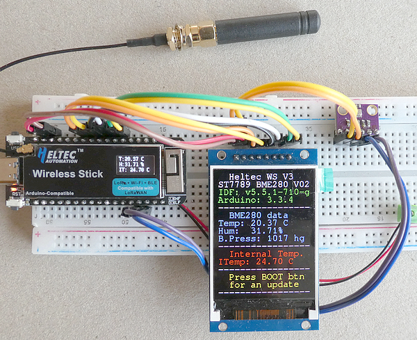
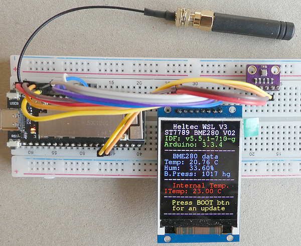

# ESP32 Heltec Wireless Stick (Lite) V3 I2C and SPI Interfaces
The sketches show how to use the I2C and SPI interfaces on the Heltec Wireless Stick (Lite) V3 devices.

This is the accompanying repository for my article "**How to connect a TFT display (SPI interface) and a BME280 sensor (I2C interface) to a Heltec Wireless Stick V3**" available here: 

For the Lite variant of the device this is the tutorial "**How to connect a TFT display (SPI interface) and a BME280 sensor (I2C interface) to a Heltec Wireless Stick Lite V3**" available here: 

## Sketches

[Heltec Wireless Stick V3 version](.Esp32_S3_Heltec_Wireless_Stick_V3_ST7789_BME280_v02)

[Heltec Wireless Stick Lite V3 version](Esp32_S3_Heltec_Wireless_Stick_Lite_V3_ST7789_BME280_v02)



## Resources for Heltec Devices

- [Heltec Wireless Stick V3 product page](https://heltec.org/project/wireless-stick-v3/)

- [Heltec Wireless Stick V3 Schematic](https://resource.heltec.cn/download/Wireless_Stick/Wireless_Stick_sch_V2.1.PDF)

- [Heltec Wireless Stick Lite V3 product page](https://heltec.org/project/wireless-stick-lite-v2/)

- [Heltec Wirless Stick Lite V3 Schematic](https://resource.heltec.cn/download/Wireless_Stick_Lite_V3/HTIT-WSL_V3_Schematic_Diagram.pdf)

- [Pinouts are in the images folder](./images)

- [Heltec GitHub Support repository](https://github.com/Heltec-Aaron-Lee/WiFi_Kit_series)



- ## Development Environment (Arduino)
````plaintext
Arduino IDE Version 2.3.6 (Windows)
arduino-esp32 boards Version 3.4.4 (https://github.com/espressif/arduino-esp32) that is based on Espressif ESP32 Version 5.5.1
````


